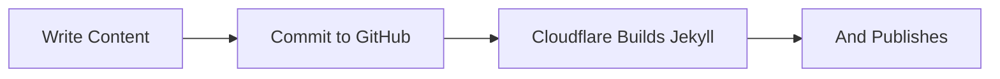

## Less Development, More Content

Today marks the very last day that I will do any *major* development for the foreseeable on this site.
The layout, infrastructure and scaffolding of it are finally where I want it all to be.

Since I started with this site in September 2025, it spent months laid dormant with just a landing page stating that something was "`Coming Soon...`"

I then decided that I needed somewhere to show myself off, as I am actively seeking a new job at the moment.
So I wrote some stuff about my past work history etc.

💡 I then had the idea of adding my CV *(resumé)*, and as I had written it in HTML, complete with stylesheet - so I could have better control over the content, rather than messing about with Word - I used that as the foundation for my website. Adding in Cards as a navigation tool.

---

Fast-forward to last month where I decided to start work on it again, and introduced Jekyll in to the foundation. Inevitably as I was experimenting with Jekyll, I added a Blog. This is all in the [`README`](https://github.com/SENPIEMAN/simongrieve.uk#-adding-jekyll) on the repo for the site.

It's since evolved in to a full-on project, a piece of my life and, a place for me to exsist online - in some weird and wonderful way.

However, I've been developing this site - in the very little spare time that I have - proper over the last 4-5 weeks. To the point where it's consumed my thought processes, and affected my mental health. That's no good!

To make the flow... well... `f l o w`... I moved the hosting of the domain away from Dynadot; and deployment of the site away from GitHub Pages and both are now managed by Cloudflare.

---

### Explaining 'The Flow' with a Flowchart

At the moment, I have a very simple workflow for adding content to the site.

> I kind of made it an un-written rule that I was going to refrain from swearing in posts on here, but holy FUCK that Mermaid took some FUCKING effort to get working, and looking right! I guess that rule is now written...

I know this entire 'flow can also be done through GitHub Pages, but having a Worker on Cloudflare, where the domain is now hosted, do everything instead just made more sense to me.

#### The To-do List

To keep myself on-track, and fully transparent, this is what I have left to do. I always make an Issue on GitHub for things like this -- but something actually on the site and in writing gives me a better goal; rather than just closing an issue when I have done it.

- [X] Create styling for checkboxes
- [X] Figure out why adding the checkboxes made social SVG's rounded
- [X] Optimise site better for mobile
- [ ] Make a tool that uploads assets to the CDN from my PC
- [ ] External links should open in a new tab
- [X] Correct Note ordering by Date on the main page
- [ ] Put a link to the RSS feed for people who still use RSS
- [ ] Make OG images ✨ prettier ✨
- [ ] Re-center the bottom navigation for posts
- [ ] Bring styling for the CV in line with new site design

Once all of these items are checked-off, I will consider this site complete, and I can move on to the next chapter. I don't know what that is exactly yet -- but we'll get there. Knowing me, I'll get bored of it, and do a complete design over-haul. Basically starting the whole process over from scratch.